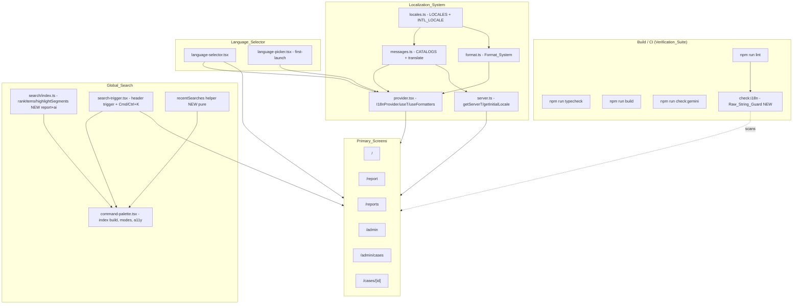

# Design Document

## Overview

Phase 3A finishes three capabilities that already exist in the codebase in working form:
complete localization across six locales, a product-grade global search, and a premium
language selector. This design is **gap-closing, not a rebuild**. The durable infrastructure
— the fail-open i18n provider, compile-time catalog typing, English fallback, the pure
in-memory search ranking core, the ⌘K command palette, the keyboard-navigable language
selector, and cookie + localStorage persistence — is correct today and MUST be preserved.

The work breaks into three tracks:

1. **Localization completeness** — grow the English catalog from ~114 keys to the 250–400
   target by extracting the remaining hardcoded user-facing strings on every primary screen,
   translate them across all six locales with strict key-set parity, wire the existing
   `lib/i18n/format.ts` formatters into every screen that renders dates/numbers/relative time,
   and add a `check:i18n` raw-string lint guard so the zero-mixed-language guarantee cannot
   regress.

2. **Search completion** — extend (not replace) the ranking core: add the `report`
   `SearchGroup` and the `AI` `SearchMode`, both required by the spec and both currently
   missing, while keeping `rankItems`, `highlightSegments`, and the palette's zero-network
   in-memory behavior intact.

3. **Selector polish + preservation** — the language selector already satisfies most of
   Requirement 11; remaining work is confirming recent-locale ordering/cap semantics and
   verifying focus/scroll/ARIA behavior, plus locking in the preservation guarantees
   (Requirement 12) and green quality gates (Requirement 13).

The design's organizing principle: **extend existing systems, add tests around existing pure
functions, and only add net-new code where a required capability (report group, AI mode,
i18n lint guard) does not yet exist.**

## Gap Analysis

This section documents, per requirement area, the current state of the local implementation
(verified by reading the actual source files) classified as **Already Complete**,
**Partially Complete**, **Missing**, or **Needs Improvement**. The design then targets only
the gaps.

### Req 1 — Complete Localization Catalog

| Aspect | Status | Evidence / Notes |
| --- | --- | --- |
| Six resolvable catalogs (en, hi, kn, bn, mr, te) | **Already Complete** | `CATALOGS: Record<Locale, Messages>` in `messages.ts`; `LOCALES` in `locales.ts`. |
| Compile-time key-set parity | **Already Complete** | Every non-en catalog is typed `Messages = Record<MessageKey, string>`; a missing key is a compile error. |
| Catalog size 250–400 keys | **Partially Complete** | Catalogs hold ~114 keys/locale today. Need extraction of remaining literals to reach ≥250. |
| Key for every user-facing string on every primary screen | **Partially Complete** | Primary screens and several key components use `t()`/`getServerT()` (home, report, reports, admin, admin/cases, site-header, nav-links, case-filters, report-form, my-reports-list). Many `components/**` (admin charts/metrics, case cards, map legend/filters, AI panels, civic insight cards, case detail screen) still contain hardcoded literals. |
| Non-empty values in all locales | **Already Complete** (for current keys) | All current catalog values are non-empty; must hold for newly added keys too. |
| Render locale value, not English substitute, for translated keys | **Already Complete** | `translate` resolves `CATALOGS[locale]?.[key]` first; only falls back when the key is absent. |

**Gap to close:** extract remaining literals (especially `/cases/[id]` and the un-wired
`components/**`), grow the catalog to 250–400 keys, translate all new keys across six locales,
preserve parity.

### Req 2 — Safe Fallback for Missing Keys

| Aspect | Status | Evidence / Notes |
| --- | --- | --- |
| Missing-in-locale → English value | **Already Complete** | `CATALOGS[locale]?.[key] ?? en[key] ?? key`. |
| Missing-in-both → raw key | **Already Complete** | Final `?? key`. |
| `{name}` interpolation | **Already Complete** | `translate` replaces every `{k}` globally for supplied vars. |
| Unsupplied placeholder left intact | **Already Complete** | Loop only iterates supplied vars; others untouched. |
| Server/client identical output | **Already Complete** | Both `useT` (provider) and `getServerT` (server) call the same `translate`. |
| Totality (never throws) | **Needs Improvement** | Interpolation builds a `RegExp` from the var name and uses `String(v)` as the replacement string. A `$` in a value is treated as a `replace` special pattern (e.g. `$&`), and a regex-special var key would break the `RegExp`. Hardening needed for true totality + literal interpolation. |

**Gap to close:** make interpolation injection-safe (escape replacement `$`, treat keys
literally) so the totality and interpolation-safety properties hold for all inputs.

### Req 3 — Zero Mixed-Language Primary Screens

| Aspect | Status | Evidence / Notes |
| --- | --- | --- |
| Active-locale rendering of strings that already use `t()` | **Already Complete** | Provider + server resolver both honor active locale. |
| No untranslated English on any primary screen | **Partially Complete** | Depends on Req 1 extraction; stray literals remain in un-wired components. |
| Live re-render on locale change without reload | **Already Complete** | `setLocale` updates React context state; consumers re-render. |
| `<html lang>` set on render | **Already Complete** | Provider `useEffect` sets `document.documentElement.lang = locale`. |
| `<html lang>` updated on locale change | **Already Complete** | Same effect re-runs on `locale` change. |

**Gap to close:** purely a function of finishing Req 1 extraction; no infrastructure change.

### Req 4 — Localized Dates and Numbers

| Aspect | Status | Evidence / Notes |
| --- | --- | --- |
| `formatDate` / `formatNumber` / `formatRelativeTime` exist and are locale-aware | **Already Complete** | `lib/i18n/format.ts` uses `INTL_LOCALE[locale]`. |
| `useFormatters` hook bound to active locale | **Already Complete** | `provider.tsx`. |
| Formatters wired across all primary screens | **Partially Complete / Needs Improvement** | Formatters exist but are not consistently used; many screens render raw timestamps/counts. Must be wired across primary screens. |
| Fallback on bad input (null/NaN/invalid) | **Needs Improvement** | `formatDate`/`formatRelativeTime` `try/catch` and return `iso`, but `new Date(null)`/invalid dates yield `"Invalid Date"` rather than returning the original input; `formatNumber(NaN)` returns `"NaN"`. Must return the original input value on invalid input. |
| Server/client identical output | **Already Complete** | Pure functions of `(value, locale)`. |

**Gap to close:** harden formatters to return the original input on invalid values, and wire
formatters into every primary screen.

### Req 5 — Raw-String Lint Guard

| Aspect | Status | Evidence / Notes |
| --- | --- | --- |
| `check:i18n` script | **Missing** | `package.json` has `typecheck`, `lint`, `build`, `check:gemini` only. No raw-string guard exists. |
| Runs as part of `npm run lint` | **Missing** | Must be wired into the lint step. |
| Reports file + line per violation | **Missing** | New tool. |
| Honors Glossary exclusions + exemption annotations | **Missing** | New tool. |
| Non-zero exit propagates to lint | **Missing** | New tool. |

**Gap to close:** design and add the `Raw_String_Guard` (new script `scripts/check-i18n.mjs`)
and compose it into `npm run lint`.

### Req 6 — Global Search Reachable Everywhere

| Aspect | Status | Evidence / Notes |
| --- | --- | --- |
| Header trigger on every primary screen | **Already Complete** | `SearchTrigger` mounted in `site-header.tsx` (shared header). |
| ⌘K / Ctrl+K opens palette, suppresses default | **Already Complete** | `search-trigger.tsx` `keydown` handler calls `preventDefault()`. |
| Trigger click opens palette | **Already Complete** | `onClick={() => setOpen(true)}`. |
| Opens without route change | **Already Complete** | Palette is a modal; no navigation on open. |
| Escape closes and restores focus | **Needs Improvement** | Escape closes, but focus is not explicitly returned to the trigger element. Must restore focus to the triggering element. |
| ⌘K while open keeps single palette + focuses input | **Needs Improvement** | Current shortcut toggles open state (`setOpen((o) => !o)`), so a second ⌘K closes the palette rather than keeping one open and refocusing the input. |

**Gap to close:** return focus to trigger on Escape; change the shortcut so a repeat press
keeps one palette open and refocuses the input.

### Req 7 — Search Result Coverage

| Aspect | Status | Evidence / Notes |
| --- | --- | --- |
| Case, locality, category, status, page groups | **Already Complete** | Built in `command-palette.tsx`; ranked by `lib/search`. |
| **Report** group | **Missing** | `SearchGroup` is `case \| category \| locality \| status \| page` — no `report`. Req 7.1/7.3 require it. |
| Case-insensitive title/keyword match | **Already Complete** | `scoreItem` lowercases query and compares to lowercased title/keywords. |
| Selecting a result navigates + closes | **Already Complete** | `go()` pushes route and closes. |
| At most 24 results, non-increasing score | **Already Complete** | `rankItems` sorts desc, `slice(0, limit=24)`. |
| Only indexed items returned | **Already Complete** | `rankItems` maps over the provided `items` only. |
| Empty query/no match → no-results indication | **Already Complete** | Palette renders `search.empty` / `search.emptyHint`. |

**Gap to close:** add the `report` group to `SearchGroup`, `MODE_GROUPS`, `GROUP_ICON`,
`groupLabel`, and build report items in the palette index from citizen reports.

### Req 8 — Search Modes

| Aspect | Status | Evidence / Notes |
| --- | --- | --- |
| Modes: all, location, problem, category, status | **Already Complete** | `SearchMode` + `MODE_GROUPS` + palette chips. |
| **AI** mode | **Missing** | `SearchMode` has no `ai`; Req 8.1/8.4 require it. |
| Exactly one active mode, all default | **Already Complete** | `useState<SearchMode>("all")`. |
| Non-all mode filters to mode's groups | **Already Complete / Needs Extension** | `MODE_GROUPS` filters; must add `problem → [case, report]`, `ai → [case]` (AI-derived fields), and `location → [locality]`. |
| All mode returns every group | **Already Complete** | `MODE_GROUPS.all = null`. |
| Mode change selects first result, or clears if empty | **Needs Improvement** | `useEffect(() => setActive(0), [results.length, mode])` resets to 0 even when empty; must clear selection (no active) when the filtered list is empty. |

**Gap to close:** add `ai` mode, extend `MODE_GROUPS` (problem→case+report, ai→case with
AI-field-derived match), and fix selection semantics on empty filtered lists.

### Req 9 — Search Suggestions, Recent, and Popular

| Aspect | Status | Evidence / Notes |
| --- | --- | --- |
| Empty-query popular results | **Partially Complete / Needs Improvement** | `scoreItem` with empty query ranks by group boost + count, but does not enforce the exact spec ordering (group priority asc, then report count desc, then label asc) nor the "at most six" cap for the popular display. |
| Recent searches shown above popular when present | **Already Complete** | Palette renders recent chips above results when `!query && recent.length`. |
| Persist 2–100 char trimmed query on select | **Needs Improvement** | `pushRecent` enforces `>= 2` but not the `<= 100` upper bound, and stores the raw (untrimmed beyond guard) query; must trim and bound 2–100. |
| ≤6 recent, most-recent-first, case-insensitive dedup, move-to-front | **Needs Improvement** | `pushRecent` caps at 6 and dedups, but dedup is case-sensitive (`x !== v`); spec requires case-insensitive dedup + move-to-front. |
| Clear recent removes all, shows popular | **Partially Complete** | Recent state exists; an explicit "clear recent" affordance (`search.clearRecent` key already present) must be wired to clear storage + state. |
| Storage failure → operate without error, show popular | **Already Complete** | `readRecent`/`pushRecent` wrapped in try/catch. |

**Gap to close:** centralize recent-search logic into a tested pure helper (trim, bound 2–100,
case-insensitive dedup, move-to-front, cap 6), enforce popular ordering + 6-cap, wire a
clear-recent control.

### Req 10 — Search Keyboard Accessibility

| Aspect | Status | Evidence / Notes |
| --- | --- | --- |
| Focus input on open | **Already Complete** | `setTimeout(() => inputRef.current?.focus(), 20)`. |
| Arrow Down/Up move + clamp | **Already Complete** | `Math.min/Math.max` clamping in `onKeyDown`. |
| Enter activates selected result | **Already Complete** | `go(results[active])`. |
| Enter with no selection/empty list → no-op | **Needs Improvement** | When list empty, `active` is 0 and `results[0]` is `undefined`, so it no-ops by accident; must be explicit once selection-clearing (Req 8.6) lands. |
| Active result kept fully in view | **Already Complete** | `scrollIntoView({ block: "nearest" })`. |
| Modal dialog semantics | **Already Complete** | `role="dialog" aria-modal="true" aria-label`. |
| Accessible names for input + list; conveys selected | **Needs Improvement** | Input has `aria-label`; result list lacks `role="listbox"`/labelled options and `aria-activedescendant`/`aria-selected`. Must add listbox/option semantics + active descendant. |
| Focus trap while open | **Needs Improvement** | No explicit focus containment; Tab can leave the palette. Must trap focus. |

**Gap to close:** add listbox/option ARIA + `aria-activedescendant`, implement focus trap and
focus restoration, make empty-list Enter an explicit no-op.

### Req 11 — Premium Language Selector

| Aspect | Status | Evidence / Notes |
| --- | --- | --- |
| Native + English name per locale | **Already Complete** | Renders `l.native` + `l.label`. |
| Selection indicator for active locale | **Already Complete** | `Check` icon when `selected`. |
| Case-insensitive substring filter (native/label/code) | **Already Complete** | `match()` in `options` memo. |
| No-results message | **Already Complete** | Renders `lang.noneFound`. |
| Focus filter input on open (<100ms) | **Already Complete** | `setTimeout(..., 10)`. |
| Arrow Up/Down highlight, clamp no-wrap | **Already Complete** | `Math.min/Math.max`. |
| Enter selects highlighted | **Already Complete** | `choose(options[active])`. |
| Escape closes without changing locale | **Already Complete** | `onKeyDown` Escape branch. |
| Outside click closes without change | **Already Complete** | `mousedown` outside handler. |
| Select applies locale, records recent, closes | **Already Complete** | `choose()` → `setLocale` + `writeRecent` + close. |
| Persist selected locale for device | **Already Complete** | Provider `setLocale` writes cookie + localStorage. |
| Persist failure still applies + closes | **Already Complete** | `writeRecent`/`setLocale` try/catch. |
| Recent locales most-recent-first, ≤3, exclude active | **Needs Improvement** | `writeRecent` caps at 3 and de-dups; `options` excludes active from the recent slice at render time, but the **stored** list can still contain the active locale. Behavior matches spec at render; confirm + add tests. |

**Gap to close:** minor — verify/lock recent-locale semantics with tests; no structural change.

### Req 12 — Preserve Existing Functionality

| Aspect | Status | Evidence / Notes |
| --- | --- | --- |
| Usable outside provider (fail-open) | **Already Complete** | `useI18n` returns English-bound fallback when no context. |
| Compile-time parity error on missing key | **Already Complete** | `Messages` type. |
| Search uses in-memory index, zero network during query | **Already Complete** | `rankItems` is pure; palette only fetches once on open. |
| Fetch case data once per session | **Already Complete** | Guarded by `cases === null && !loading`. |
| Persist locale to cookie + localStorage | **Already Complete** | Provider `setLocale`. |
| Initialize locale from persisted value | **Already Complete** | `getInitialLocale` (cookie, server) + provider seed; picker reads cookie/localStorage. |

**Gap to close:** none — these are invariants to protect with tests and regression checks.

### Req 13 — Quality Gates Green

| Aspect | Status | Evidence / Notes |
| --- | --- | --- |
| `typecheck`, `lint`, `build`, `check:gemini` exist | **Already Complete** | `package.json` scripts. |
| `lint` includes raw-string guard | **Missing** | Depends on Req 5. |
| All gates pass at completion | **Needs Verification** | Run the Verification_Suite after each track. |

**Gap to close:** add `check:i18n` to the lint step; keep all gates green.

### Gap Summary (net-new vs. extend vs. verify)

- **Net-new code:** `scripts/check-i18n.mjs` (Raw_String_Guard); `report` group + `ai` mode
  plumbing; a tested `recentSearches` pure helper; a tested interpolation-safe `translate`;
  hardened `format.ts` fallbacks; listbox/focus-trap ARIA in the palette.
- **Extend existing:** catalog growth (250–400 keys) + translations; wiring `t()` and
  `useFormatters` into remaining `components/**` and `/cases/[id]`; `MODE_GROUPS` extension;
  popular-ordering + recent-search semantics.
- **Verify/lock with tests only:** language selector behavior, fail-open provider,
  zero-network search, single-fetch index, locale persistence/initialization.

## Architecture

The subsystems and their relationships are unchanged; the design adds the Raw_String_Guard as
a new build-time actor and extends the search core.



### Key architectural decisions

- **Extend the search core in place.** Adding `report` to `SearchGroup` and `ai` to
  `SearchMode` is a type-and-table change in `lib/search/index.ts` plus index construction in
  the palette. The pure ranking contract (`rankItems` returns ≤24 indexed items in
  non-increasing score order) is unchanged, so existing properties continue to hold.

- **Centralize recent-search logic.** The dedup/bound/move-to-front rules (Req 9.3, 9.4) are
  currently inline in `pushRecent`. Extracting a pure `addRecentSearch(list, query)` (and
  `loadRecentSearches`/`saveRecentSearches` thin storage wrappers) makes the bound/dedup/
  idempotence properties directly testable without a DOM.

- **Raw_String_Guard as a standalone Node script.** A dependency-free `scripts/check-i18n.mjs`
  (consistent with the existing `scripts/check-gemini.mjs`) scans `app/**` and `components/**`
  for JSX text nodes / common string-bearing attributes, applies Glossary exclusions and an
  inline `// i18n-exempt` annotation, and exits non-zero with `file:line` diagnostics. It is
  composed into `npm run lint` so the existing gate enforces it.

- **Harden pure helpers, don't rewrite them.** `translate` interpolation and `format.ts`
  fallbacks get small, behavior-preserving robustness fixes so the totality properties hold
  for adversarial inputs.

## Components and Interfaces

### Localization_System (extend + harden)

`lib/i18n/messages.ts`
- `CATALOGS`, `Messages`, `MessageKey`, `translate` — unchanged public shape.
- Catalog grows to 250–400 keys; every locale keeps parity via the `Messages` type.
- `translate` interpolation hardened:

```ts
export function translate(
  locale: Locale,
  key: MessageKey,
  vars?: Record<string, string | number>,
): string {
  let str: string = CATALOGS[locale]?.[key] ?? en[key] ?? key;
  if (vars) {
    for (const [k, v] of Object.entries(vars)) {
      // literal placeholder match; replacement treated as a literal (no $ specials)
      str = str.split(`{${k}}`).join(String(v));
    }
  }
  return str;
}
```
Using `split/join` avoids both `RegExp` construction from arbitrary keys and `$`-pattern
interpretation in the replacement, guaranteeing totality and literal interpolation.

`lib/i18n/format.ts` (harden fallback)
- `formatDate(iso, locale, opts?)`, `formatNumber(value, locale)`,
  `formatRelativeTime(iso, locale)` — same signatures.
- Add explicit validity checks so invalid input returns the **original input** unchanged:

```ts
export function formatNumber(value: number, locale: Locale): string {
  if (typeof value !== "number" || !Number.isFinite(value)) return String(value);
  try { return value.toLocaleString(INTL_LOCALE[locale]); }
  catch { return String(value); }
}
// formatDate/formatRelativeTime: if Number.isNaN(new Date(iso).getTime()) return iso;
```

`lib/i18n/provider.tsx`, `lib/i18n/server.ts` — unchanged; continue to delegate to
`translate`/formatters so server and client stay identical.

### Global_Search (extend)

`lib/search/index.ts`
```ts
export type SearchGroup =
  | "case" | "report" | "category" | "locality" | "status" | "page"; // + report

export type SearchMode =
  | "all" | "problem" | "location" | "category" | "status" | "ai";    // + ai

const MODE_GROUPS: Record<SearchMode, SearchGroup[] | null> = {
  all: null,
  problem: ["case", "report"], // problem maps to case + report
  location: ["locality"],
  category: ["category"],
  status: ["status"],
  ai: ["case"],                // AI-derived case matches only
};
```
- `rankItems(items, query, mode, limit=24)` — unchanged algorithm; pool now also filters the
  new groups. AI mode additionally restricts case matches to AI-derived fields (summary +
  keywords) via the index builder marking those items / an `aiMatchable` flag the ranker
  honors, so Req 8.4 holds without fabricating results.
- `highlightSegments(text, query)` — unchanged (round-trip property preserved).

`lib/search/recent.ts` (new, pure)
```ts
export function addRecentSearch(list: string[], rawQuery: string): string[];
// trims; ignores < 2 or > 100 chars; case-insensitive dedup + move-to-front; cap 6
export function loadRecentSearches(): string[];   // try/catch → []
export function saveRecentSearches(list: string[]): void; // try/catch → no-op
export function clearRecentSearches(): void;       // try/catch → no-op
```

`lib/search/popular.ts` (new, pure) — or a helper in `index.ts`:
```ts
export function popularItems(items: SearchItem[], limit = 6): SearchItem[];
// order by group priority asc, then count desc, then label (case-insensitive) asc; take 6
```

`components/search/command-palette.tsx`
- Build `report` items from citizen reports in the index (alongside cases/localities).
- Add `ai` mode chip; map chips to the six modes.
- Replace inline recent logic with `lib/search/recent.ts`; wire a clear-recent control to
  `search.clearRecent`.
- Selection semantics: on mode/results change, select first result if any, else clear
  selection (`active = -1`); Enter with no selection / empty list is an explicit no-op.
- A11y: result container `role="listbox"` with accessible name, each row `role="option"` with
  `aria-selected`, palette uses `aria-activedescendant` pointing at the active option id;
  implement a focus trap and restore focus to the trigger on close.

`components/search/search-trigger.tsx`
- ⌘K/Ctrl+K: if palette closed → open; if already open → keep open and refocus input (no
  toggle-close). Track the trigger element to restore focus on Escape/close.

### Language_Selector (verify + lock)

`components/i18n/language-selector.tsx`, `components/i18n/language-picker.tsx` — no structural
change. Recent-locale helper logic mirrors the search recent helper semantics (most-recent
first, cap 3, exclude active at render). Behavior locked with tests.

### Raw_String_Guard (new)

`scripts/check-i18n.mjs`
- Input: `app/**/*.{ts,tsx}`, `components/**/*.{ts,tsx}`.
- Detects JSX text nodes and string literals in user-facing attributes (`placeholder`,
  `aria-label`, `title`, `alt`) that are not wrapped by `t()`/`getServerT()`.
- Excludes Glossary exclusions: proper nouns (`Velora`, `Vibe2Ship`), technical tokens
  (e.g. `FIREBASE_SERVICE_ACCOUNT_KEY`), pure numerals/symbols, and lines annotated
  `// i18n-exempt`.
- Output: one `path:line: message` per violation; exit `0` when clean, non-zero otherwise.
- `package.json`: add `"check:i18n": "node scripts/check-i18n.mjs"` and chain it in lint, e.g.
  `"lint": "next lint && npm run check:i18n"`, so Req 5.1/5.5 and Req 13.2 hold.

## Data Models

No persistent schema changes. The relevant in-memory/contract models:

### SearchItem (extended group set)
```ts
interface SearchItem {
  id: string;
  group: "case" | "report" | "category" | "locality" | "status" | "page";
  title: string;       // already localized by caller
  subtitle?: string;   // already localized
  href: string;        // navigation target
  keywords: string;    // lowercased searchable blob
  count?: number;      // tiebreaker / badge (e.g. report count)
  aiMatchable?: boolean; // marks case items whose match derives from AI fields (AI mode)
}
```

### Message catalog
```ts
type MessageKey = keyof typeof en;          // en is source of truth
type Messages = Record<MessageKey, string>; // parity enforced at compile time
const CATALOGS: Record<Locale, Messages>;   // en, hi, kn, bn, mr, te
```

### Persistence (unchanged keys)
- `velora.locale` — cookie + localStorage (active locale).
- `velora.recentLocales` — localStorage, ≤3 codes, most-recent first.
- `velora.recentSearches` — localStorage, ≤6 trimmed queries, most-recent first, deduped.

### Search mode → group mapping
```ts
all → every group
problem → [case, report]
location → [locality]
category → [category]
status → [status]
ai → [case] (AI-derived fields only)
```

## Correctness Properties

*A property is a characteristic or behavior that should hold true across all valid executions
of a system — essentially, a formal statement about what the system should do. Properties
serve as the bridge between human-readable specifications and machine-verifiable correctness
guarantees.*

Each property below is universally quantified and implemented as a single property-based test
(minimum 100 iterations). Properties target the pure cores of this feature: the catalogs and
`translate`, the `format.ts` formatters, and the search helpers (`rankItems`,
`highlightSegments`, recent-list, popular, clamp, filter predicate). UI/timing/ARIA criteria
are validated by example/component tests instead (see Testing Strategy).

### Property 1: Catalog key-set parity

*For all* Supported_Locales, the set of keys in that locale's Message_Catalog equals the set of
keys in the English Message_Catalog exactly — no missing keys and no extra keys.

**Validates: Requirements 1.1, 1.4**

### Property 2: Total non-empty catalog values (incl. fail-open English resolution)

*For all* Supported_Locales and *for all* message keys, the catalog maps the key to a string
containing at least one non-whitespace character; consequently, *for all* English keys,
resolving via the fail-open default-locale translator returns a non-empty string.

**Validates: Requirements 1.5, 12.1**

### Property 3: Translate fallback chain

*For all* keys and locales, `translate` returns the active locale's value when present, else
the English value when the key exists only in English, else the raw key string when the key is
absent from both catalogs.

**Validates: Requirements 2.1, 2.2**

### Property 4: Interpolation safety

*For all* resolved templates and supplied interpolation maps, every occurrence of each supplied
`{name}` placeholder is replaced by the literal string form of its value, and any placeholder
with no supplied value is left unchanged in the output.

**Validates: Requirements 2.3, 2.4**

### Property 5: Translate totality

*For all* keys, locales, and interpolation maps — including values containing `$`, `{`, `}`, or
regex metacharacters — `translate` returns a string and never throws.

**Validates: Requirements 2.6**

### Property 6: Format fallback totality

*For all* inputs that are null, undefined, NaN, or otherwise not a valid date or number,
`formatDate`, `formatNumber`, and `formatRelativeTime` return the original input value and never
throw.

**Validates: Requirements 4.4**

### Property 7: Highlight round-trip

*For all* texts and queries, concatenating in order the `text` fields of the segments produced
by `highlightSegments(text, query)` reconstructs the original `text` exactly.

**Validates: Requirements 7.2, 7.3, 7.4, 7.5**

### Property 8: Ranking soundness

*For all* item lists, queries, and modes, `rankItems` returns at most 24 items, every returned
item is a member of the input list (no fabricated results), scores are non-increasing across
the result order, and a query that matches no indexed item yields an empty result set.

**Validates: Requirements 7.7, 7.8, 7.9**

### Property 9: Mode filtering

*For all* item lists and queries, every result returned for a non-`all` Search_Mode belongs to
that mode's allowed Search_Result_Groups (location→locality, problem→case+report,
category→category, status→status).

**Validates: Requirements 8.2**

### Property 10: AI-mode restriction

*For all* item lists and queries, every result returned for the `ai` Search_Mode is a case
result whose match derives from AI-generated case fields (case summary and case keywords).

**Validates: Requirements 8.4**

### Property 11: Popular ordering and cap

*For all* item lists, `popularItems` returns at most six items ordered by ascending
Search_Result_Group priority, then descending associated report count, with ties broken by
case-insensitive ascending result label.

**Validates: Requirements 9.1**

### Property 12: Recent-search bound, dedup, and idempotence

*For all* sequences of submitted queries, the recent-search list never exceeds six entries,
contains no two entries equal under case-insensitive comparison, places the most recently added
entry first, ignores queries whose trimmed length is below 2 or above 100, stores the trimmed
form, and is idempotent — adding the same query twice yields the same list as adding it once.

**Validates: Requirements 9.3, 9.4**

### Property 13: Storage-helper totality

*For all* device-storage failure conditions, `loadRecentSearches` returns an empty list and
`saveRecentSearches`/`clearRecentSearches` complete without throwing.

**Validates: Requirements 9.6**

### Property 14: Recent-locale bound, dedup, and active exclusion

*For all* sequences of locale selections, the recently-used-locales list never exceeds three
entries, contains no duplicates, places the most recently selected locale first, and excludes
the currently active locale from the rendered recent list.

**Validates: Requirements 11.13**

### Property 15: Language-filter substring predicate

*For all* Supported_Locales and filter queries, the locale is included in the filtered list if
and only if the (case-insensitive) query is a substring of the locale's native name, English
label, or locale code.

**Validates: Requirements 11.3**

### Property 16: Selection-index clamp (shared by search and selector)

*For all* current indices, list lengths, and Arrow Up/Down inputs, the next selection index
stays within `[0, length-1]`, moves by exactly one in the requested direction except at the
boundaries, and never wraps around.

**Validates: Requirements 10.2, 11.6**

## Error Handling

The design preserves the existing fail-open philosophy and extends it to the new surfaces.

- **Localization resolution.** `translate` never throws: unknown keys fall back English →
  raw key; interpolation uses `split/join` so adversarial values/keys cannot raise (Property 3,
  4, 5). Components rendered outside the provider use `useI18n`'s English-bound fallback
  (Req 12.1).
- **Formatters.** Invalid dates/numbers return the original input rather than `"Invalid Date"`
  / `"NaN"`; all paths are wrapped so the Format_System is total (Property 6, Req 4.4).
- **Search index load.** The palette's single `fetch('/api/cases')` is guarded by
  `cases === null && !loading`; failure sets an `error` flag and renders `search.error` while
  keeping the palette operable. Ranking itself is pure and issues zero network calls during
  querying (Req 12.3, 12.4).
- **Recent searches / recent locales.** All reads/writes are wrapped; storage unavailability
  degrades to in-session behavior and shows popular results (Property 13, Req 9.6, 11.12).
- **Raw_String_Guard.** On internal error (e.g. a file it cannot parse) the guard reports the
  file and continues; it only exits non-zero for actual violations so it cannot produce false
  CI failures unrelated to raw strings. Violations print `path:line: message` and exit non-zero
  (Req 5.2, 5.5).
- **Keyboard/focus.** Escape and outside-click always close their surface without mutating
  locale or route; empty-list Enter is an explicit no-op (Req 6.5, 10.4, 11.8, 11.9).

## Testing Strategy

Property-based testing **is appropriate** for this feature: its correctness-critical logic is a
set of pure functions (catalogs, `translate`, `format.ts`, `rankItems`, `highlightSegments`,
recent/popular/clamp/filter helpers) with universal properties over large input spaces. UI
wiring, ARIA, focus, timing, persistence side-effects, and build gates are validated with
example/component/smoke tests.

### Tooling

- **Test runner:** Vitest (fast, native TS/ESM, integrates with the Next.js + TS toolchain).
- **Property-based library:** fast-check (the standard PBT library for the TS/JS ecosystem).
  Property tests are **not** implemented from scratch.
- **Component/DOM tests:** @testing-library/react + jsdom for palette, selector, and provider
  behavior.
- Add dev dependencies and a `test` script (`vitest run`); these tests are developer/CI gates
  and do not alter the Verification_Suite definition.

### Property tests (one per property, ≥100 iterations)

Each property test is tagged with a comment of the form
`Feature: phase-3a-completion, Property {n}: {property_text}` and maps to a Correctness Property
above:

- P1 parity, P2 non-empty values — over `lib/i18n/messages.ts`.
- P3 fallback chain, P4 interpolation safety, P5 totality — over `translate`.
- P6 format fallback totality — over `lib/i18n/format.ts`.
- P7 highlight round-trip, P8 ranking soundness, P9 mode filtering, P10 AI-mode restriction —
  over `lib/search/index.ts` (with fast-check generators producing random `SearchItem[]`,
  queries, and modes).
- P11 popular ordering/cap — over `popularItems`.
- P12 recent-search bound/dedup/idempotence, P13 storage totality — over `lib/search/recent.ts`.
- P14 recent-locale semantics, P15 filter predicate, P16 selection clamp — over the selector
  helpers.

### Example / component / edge tests

- **Localization wiring:** representative date/number/relative-time outputs per locale
  (Req 4.1–4.3); document `lang` set/updated on render and locale change (Req 3.4, 3.5); live
  re-render on locale change (Req 3.3); server/client parity for representative keys
  (Req 2.5, 4.5).
- **Search UI:** group coverage with a full-spectrum index (Req 7.1), per-group match + href
  (Req 7.2–7.5), select navigates + closes (Req 7.6), six mode chips + default `all`
  (Req 8.1), all-mode multi-group (Req 8.3), mode-change selection/empty semantics
  (Req 8.5, 8.6), keyboard open/focus/Enter/Escape/trap and ARIA listbox/activedescendant
  (Req 6.2–6.6, 10.1, 10.3–10.8), single-fetch + zero query-time network (Req 12.3, 12.4).
- **Selector UI:** native+label render, active indicator, no-results message, focus on open,
  Enter/Escape/outside-click, apply+persist+recent, persist-failure resilience
  (Req 11.1, 11.2, 11.4, 11.5, 11.7–11.12).
- **Raw_String_Guard:** fixture-based — dirty fixture reports `file:line` and exits non-zero;
  clean fixture exits zero; Glossary exclusions and `// i18n-exempt` suppress violations
  (Req 5.2–5.5).
- **Catalog size:** assert `250 ≤ keys(en) ≤ 400` (Req 1.3).

### Smoke / gate checks (Verification_Suite)

- `npm run typecheck` (incl. compile-time parity error on a missing key, Req 12.2, 13.1),
  `npm run lint` (incl. `check:i18n`, Req 5.1, 13.2), `npm run build` (Req 13.3),
  `npm run check:gemini` (Req 13.4). All must exit zero for Phase 3A to be production-ready
  (Req 13.5).

### Test balance

Property tests carry the universal-correctness load (parity, totality, ranking, dedup); example
tests cover concrete wiring, ARIA, persistence, and exact localized output; smoke tests confirm
the gates. This keeps the unit-test count focused while property tests provide broad input
coverage.
