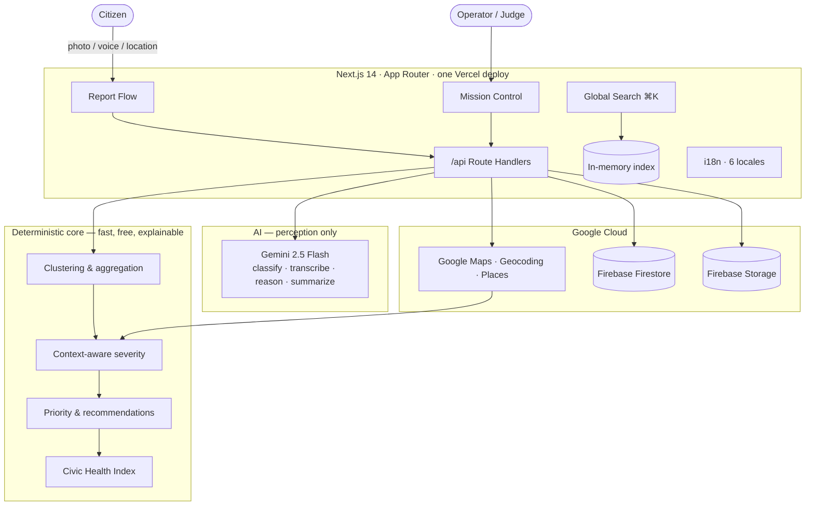

# Velora Civic AI

**An AI Civic Operations Center — from issue reporting to issue resolution.**


Built for the **Coding Ninjas × Google — Vibe2Ship** Hackathon
(Problem Statement #2 — _Community Hero: Hyperlocal Problem Solver_).

Velora is not a complaint form. It is an AI-powered civic intelligence platform:
citizens report issues (by photo or voice, in any language), AI explains its
understanding, a deterministic engine **aggregates many reports into one
undeniable civic case**, and an operations center prioritizes and tracks each
case to resolution — with a living **Civic Health Index** for the whole city.

---

## Table of Contents

- [Problem Statement](#problem-statement)
- [Solution](#solution)
- [Why This Is Different](#why-this-is-different)
- [Features](#features)
- [Architecture](#architecture)
- [AI Workflow](#ai-workflow)
- [Technology Stack](#technology-stack)
- [Google Technologies](#google-technologies)
- [Screenshots & Demo](#screenshots--demo)
- [Installation](#installation)
- [Environment Setup](#environment-setup)
- [Deployment](#deployment)
- [Project Structure](#project-structure)
- [Performance](#performance)
- [Accessibility](#accessibility)
- [Security](#security)
- [Judging Criteria Mapping](#judging-criteria-mapping)
- [Future Roadmap](#future-roadmap)
- [License & Acknowledgements](#license--acknowledgements)

---

## Problem Statement

Communities face constant hyperlocal problems — potholes, water leaks, broken
streetlights, garbage, drainage. Existing reporting is **fragmented**,
**opaque**, **hard to track**, and **slow to resolve**. A single citizen
complaint carries little weight and is easily lost. Citizens lack a way to turn
scattered voices into collective, undeniable pressure — and authorities lack a
clear, prioritized operating picture.

## Solution

Velora takes an issue from report to resolution:

1. **Report** — a citizen submits an issue with a photo or **voice note (any
   language)** and a location. Anonymous by default; optional identity.
2. **Understand** — Gemini classifies the issue and **shows its reasoning**
   (category, confidence, keywords, transcript).
3. **Contextualize** — Geocoding + Places compute an **explainable,
   context-aware severity** (e.g. "within 40m of a hospital: +25").
4. **Aggregate** — a deterministic engine merges nearby same-category reports
   into one **civic case** (duplicate detection without AI/embeddings).
5. **Operate** — an explainable **agentic operations brief**, priority,
   recommendations, status workflow, and a **Civic Health Index**.

## Why This Is Different

- **It reasons and explains, never a black box.** Every AI output shows inputs,
  reasoning, confidence, and sources; priority is deterministic and transparent.
- **Aggregation moat.** Many weak reports become one undeniable, prioritized
  civic case.
- **Context-aware severity.** Severity is computed from real urban context
  (schools, hospitals, transit) via Google Places — not guessed.
- **Civic Health Index.** A living, deterministic 0-100 score per city /
  category / ward — a memorable, accountable headline metric.
- **Token-disciplined AI.** Gemini is the perception layer only; clustering,
  severity, priority, health, and analytics are all deterministic and cached.

## Features

- **Multilingual (6 languages)** — English, Hindi, Kannada, Bengali, Marathi,
  Telugu — with runtime switching, a header selector, a first-launch picker,
  persisted preference, and per-script Noto fonts.
- Interactive **India civic map** with **client-side clustering + density
  bubbles**, **on-map status/category filter chips**, animated marker
  selection, and a **responsive bottom-sheet preview** (card on desktop). Status
  colors throughout; graceful no-API-key fallback.
- **Citizen reporting**: **category-first** flow (category is the only required
  field), optional details, photo, **voice record/upload**. **Location by
  address search or one-tap GPS** — reverse-geocoded, so citizens never see or
  type coordinates (manual entry stays a collapsed fallback). **Anonymous or
  Verified Citizen** (optional name/phone/email for follow-up); drafts
  auto-save; device-scoped "My Reports" with a **civic-impact achievement** card.
- **Visible AI reasoning** per report; **AI case summaries** + **agentic
  operations brief** with confidence and trust indicators; an **"Ask Velora"**
  tool-using agent with a live thinking indicator.
- **Deterministic aggregation engine** with a keyword false-merge guard.
- **Context intelligence**: reverse-geocoded locality + nearby landmarks →
  explainable severity.
- **Mission Control operations center**: a command-center layout with an
  **alert rail**, **priority board**, **AI dock**, **live activity stream**, and
  an embedded ops map — over the status workflow (Reported → Verified → In
  Progress → Resolved), operations timeline, and decision-transparency panel.
- **Real analytics**: accessible, dependency-free **charts** (case status mix,
  severity distribution, 7-day activity, category breakdown) — each with a
  screen-reader data-table alternative.
- **Civic Health Index** + explainable insights + community-impact estimates.
- **Premium experience**: token-driven design system, light/dark theme,
  brand/illustration kit, animated metrics, **page transitions, scroll reveals,
  and resolution/submission celebrations** — all respecting
  `prefers-reduced-motion`.

## Architecture



```
Next.js 14 (App Router, RSC)              ── one app, one Vercel deploy
 ├─ Client islands: map (+clustering/filters), report form, voice recorder,
 │                  status mgr, theme + i18n providers, motion wrappers
 ├─ Server components: home, Mission Control, case detail, my reports
 └─ Route Handlers (/api): reports, cases, case status, agent, geo
        │
        ├─ Gemini 2.5 Flash    ── PERCEPTION ONLY (classify, transcribe, reason, summarize)
        ├─ Deterministic core  ── distance, clustering, severity, priority, health, insights, charts
        ├─ Google Maps Platform── map + Geocoding + Places (context)
        ├─ Firebase Firestore  ── reports, civicCases
        └─ Firebase Storage    ── photos, voice notes
```

**Design principle:** Gemini is used **only** for perception. All distance,
clustering, aggregation, severity, priority, health, and analytics are
deterministic — fast, free, explainable, and demo-stable. AI outputs are cached
(report analysis is immutable; case summaries/briefs are cached by state).

## AI Workflow

```
Report (photo/voice + text + location)
   │
   ├─ ONE Gemini multimodal call ─▶ { category, confidence, reasoning, keywords,
   │                                  summary, transcript }   (cached on report)
   ├─ Deterministic context (Maps) ─▶ address + nearby places ─▶ explainable severity
   ├─ Deterministic aggregation ─▶ attach to nearest same-category case (≤150m) or create
   └─ On case view ─▶ cached AI summary + agentic operations brief
                       (deterministic priority/recommendation/timeline)
```

Robustness: unsupported audio falls back to text-only analysis; if Gemini is
unconfigured, reports still submit, aggregate, and get deterministic briefs.

## Technology Stack

| Layer    | Choice                                         |
| -------- | ---------------------------------------------- |
| Frontend | Next.js 14 (App Router), TypeScript            |
| UI       | Tailwind CSS, shadcn/ui, lucide-react          |
| Backend  | Next.js Route Handlers                         |
| Database | Firebase Firestore                             |
| Storage  | Firebase Storage                               |
| Maps     | Google Maps Platform (Maps, Geocoding, Places) |
| AI       | Gemini 2.5 Flash (Google AI Studio)            |
| Forms    | React Hook Form + Zod                          |
| Geo      | geolib (haversine distance)                    |
| i18n     | Lightweight 6-language provider + Noto fonts   |
| Charts   | Dependency-free accessible SVG primitives      |
| Motion   | CSS + Web Animations API (reduced-motion safe) |
| Deploy   | Vercel                                         |

## Google Technologies

- **Gemini 2.5 Flash** (via Google AI Studio) — multimodal classification, voice
  transcription, reasoning, case summaries, and the agentic operations brief.
- **Google Maps Platform** — interactive map + **Geocoding API** (localities) +
  **Places API** (nearby context for explainable severity).
- **Firebase** (Firestore + Storage) — data and media persistence.

## Screenshots & Demo

### Live Demo

🔗 **Live app:** _add your Vercel URL here_ (e.g. `https://velora-civic-ai.vercel.app`)

### Demo Video

🎥 **Walkthrough (90s):** _add your demo video link here_ — see [`docs/DEMO_SCRIPT.md`](./docs/DEMO_SCRIPT.md) for the exact narration, click order, and timing.

### Screenshots

> Capture guide and exact framing for the 8 hero shots:
> [`docs/SCREENSHOT_PLAN.md`](./docs/SCREENSHOT_PLAN.md).
> Save captures to `docs/screenshots/` and they will render below.

| | |
| --- | --- |
|  |  |
|  |  |
|  |  |
|  |  |

_Images are placeholders until captured; the layout above renders automatically once the files exist._

## Installation

```bash
npm install
cp .env.example .env.local   # fill in keys (see Environment Setup)
npm run dev                  # http://localhost:3000
```

### Scripts

```bash
npm run dev          # dev server
npm run build        # production build
npm run typecheck    # tsc --noEmit
npm run lint         # next lint
npm run seed         # seed demo issues into Firestore (needs admin creds)
npm run check:gemini # validate the live Gemini classification path
```

## Environment Setup

Copy `.env.example` → `.env.local`:

- `NEXT_PUBLIC_GOOGLE_MAPS_API_KEY` — Maps JavaScript API (client)
- `GOOGLE_MAPS_SERVER_KEY` — Geocoding + Places (server; falls back to public key)
- `GEMINI_API_KEY` — Google AI Studio (server)
- `NEXT_PUBLIC_FIREBASE_*` — Firebase web config (client)
- `FIREBASE_SERVICE_ACCOUNT_KEY` — base64/JSON service account (server)
- `FIREBASE_STORAGE_BUCKET` — e.g. `your-project.appspot.com`

The app degrades gracefully when keys are missing (map placeholder / demo data;
AI features skipped).

### Firebase rules (demo)

```
// Storage — allow citizen uploads under reports/
match /reports/{allPaths=**} { allow read, write: if true; }
```

## Deployment

1. Push to GitHub and import the repo into Vercel (Next.js auto-detected).
2. Add every variable from `.env.example` under **Settings → Environment
   Variables**; enable the **Geocoding API + Places API** on the Maps key.
3. Deploy. `package-lock.json` ensures reproducible installs.

## Project Structure

```
app/         routes (home, report, reports, cases/[id], admin, admin/cases) + /api
components/  ui/ (shadcn), map/, report/, ai/, cases/, operations/, health/,
             civic/, trust/, admin/, nav, theme
lib/         aggregation, civic-cases, context, operations, civic-health,
             civic-insights, insights, reports, constants, ai/, firebase/, gemini/
types/       domain models
scripts/     seed.ts, check-gemini.mjs
docs/        hackathon submission content
```

## Performance

- Gemini calls are minimized and cached (one perception call per report,
  immutable; briefs/summaries cached by state). Deterministic core adds no
  network cost.
- Single-field Firestore queries with in-memory sorts (no composite indexes).
- Lazy-loaded recorder, lazy images, SVG markers, GPU-friendly motion.

## Accessibility

- Keyboard navigation with `aria-current` on the active nav and visible focus
  rings; `prefers-reduced-motion` honored; labeled form controls; map region
  labeled; semantic structure throughout.

## Security

See [SECURITY.md](./SECURITY.md). No secrets in the repo; server-only secrets
are `"server-only"`-guarded; report input is Zod-validated; external calls fail
open.

## Judging Criteria Mapping

| Criterion (weight)             | Where Velora delivers                                                               |
| ------------------------------ | ----------------------------------------------------------------------------------- |
| Problem Solving & Impact (20%) | Aggregation + vernacular voice + context-aware severity + Civic Health Index        |
| Agentic Depth (20%)            | Agentic operations brief, deterministic priority + recommendations + timeline       |
| Innovation (20%)               | Context-aware explainable severity, collective-case aggregation, Civic Health Index |
| Google Technologies (15%)      | Gemini 2.5 Flash + Maps + Geocoding + Places + Firebase                             |
| Product & Design (10%)         | Premium design system, light/dark theme, cohesive UX                                |
| Technical Implementation (10%) | Typed, modular, token-disciplined, deterministic-first                              |
| Completeness & Usability (5%)  | Full lifecycle report → resolution + admin operations                               |

## Future Roadmap

- Department routing, notifications, and one-tap escalation (clean seams exist).
- Authenticated roles; real-time dashboards; temporal auto-escalation.
- Full dark-mode component audit; report stepper; admin mission-control layout.

## License & Acknowledgements

- **License:** [MIT](./LICENSE)
- **Built with:** Google AI Studio (Gemini), Google Maps Platform, Firebase,
  Next.js, Tailwind, shadcn/ui.
- See [CHANGELOG.md](./CHANGELOG.md) and [CONTRIBUTING.md](./CONTRIBUTING.md).
